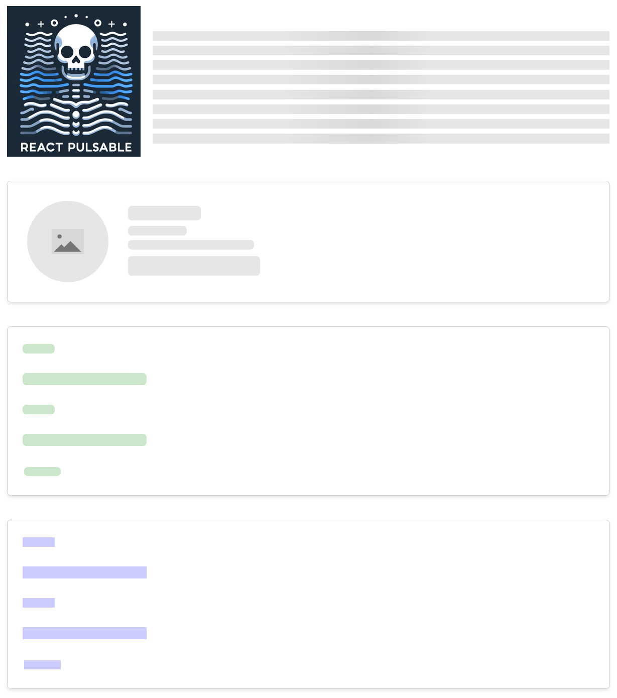

# React Pulsable

This is a simple react component that can be used to wrap other components and add a pulsing/skeleton effect to them.

**[Code Sandbox Link](https://codesandbox.io/s/k7fdzw?file=/src/App.js)**



### how to use it?

```jsx
const App = ({ isLoading }: { isLoading: boolean }) => {
  return (
    <>
      {/* default background */}
      <Pulsable isLoading={isLoading}>
        <YourComponent2 />
      </Pulsable>

      {/* custom background */}
      <Pulsable
        isLoading={isLoading}
        config={{
          bgColors: {
            light: 'rgba(0, 128, 0, 0.2)',
            medium: 'rgba(0, 128, 0, 0.3)',
          },
        }}
      >
        <YourComponent />
      </Pulsable>

      {/* custom background with no rounded corners */}
      <Pulsable
        isLoading={isLoading}
        config={{
          noRadius: true,
          bgColors: {
            light: 'rgba(0, 0, 255, 0.2)',
            medium: 'rgba(0, 0, 255, 0.3)',
          },
        }}
      >
        <YourComponent />
      </Pulsable>

      {/* custom background with no padding in each skeleton items */}
      <Pulsable
        isLoading={isLoading}
        config={{
          noPadding: true,
          bgColors: {
            light: 'tomato',
            medium: 'orange',
          },
        }}
      >
        <YourComponent />
      </Pulsable>
    </>
  );
};
```

### what you have to do in your component?

```jsx
const YourComponent = () => {
  return (
    <form>
      <label htmlFor="name" className="pulsable">
        Name:
      </label>
      <div className="pulsable">
        <input type="text" id="name" />
      </div>

      <label htmlFor="email" className="pulsable">
        Email:
      </label>
      <div className="pulsable">
        <input type="email" id="email" />
      </div>

      <button className="pulsable" type="submit">
        Submit
      </button>
    </form>
  );
};
```

## Usage Guide

The component takes following props:
- `isLoading`: a boolean that indicates whether the component should be pulsing or not.
- `config`: an object that contains the configuration for the pulsing effect. It has following properties:
  - `bgColors`: an object that contains the background colors for the pulsing effect. It has two properties:
    - `light`: the light color of the background.
    - `medium`: the medium color of the background.
  - `noRadius`: a boolean that indicates whether the pulsing effect should have rounded corners or not. By default it has rounded corners.
  - `noPadding`: a boolean that indicates whether the pulsing effect should have padding in each skeleton items or not. By default it has padding.
  - `animation`: you can pass animation type as a string. default is `wave` and other options are `wave-reverse`, `pulse`, `none

- `className`: as Pulsable component is a wrapper component, you can pass className or alomost all attributes of div element.[means you can treat it as a div, and use accordingly]

> check [example](https://codesandbox.io/s/k7fdzw?file=/src/App.js) for more.

### Conditions:

- You must wrap the component you want to add the pulsing effect to with the `Pulsable` component.
- You must provide isLoading state to the `Pulsable` component.
- You can use the `className="pulsable"` to add the pulsing effect to any element.
- if your component is a self closing tag like `` you should have to wrap it with div and add `pulsable` class to that. 
- if you want to hide some components while loading add class name `pulsable-hidden`
- if you want to add image icon in skeleton add class name `pulsable-img`
- for the paragraph use classname `pulsable-para`

- As Shown in example, for better performance you can use `flex` and  `align-items: flex-start` in parentNode to avoid the pulsing effect from stretching the component. you can also add these styles conditionally wihile loading, if it's affecting your design.

